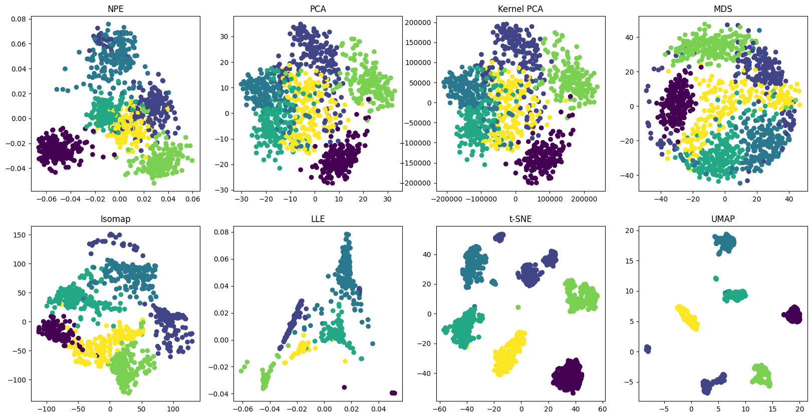

# Neighborhood Preserving Embedding (NPE)

## Abstract
Recently there has been a lot of interest in geometrically motivated approaches to data analysis in high dimensional spaces. We consider the case where data is drawn from sampling a probability distribution that has
support on or near a submanifold of Euclidean space. In this paper, we propose a novel subspace learning algorithm called Neighborhood Preserving Embedding (NPE). Different from Principal Component Analysis (PCA) which aims
at preserving the global Euclidean structure, NPE aims at preserving the local neighborhood structure on the data manifold. Therefore, NPE is less sensitive to outliers than PCA. Also, comparing to the recently proposed manifold
learning algorithms such as Isomap and Locally Linear Embedding, NPE is defined everywhere, rather than only on the training data points. Furthermore, NPE may be conducted in the original space or in the reproducing kernel
Hilbert space into which data points are mapped. This gives rise to kernel NPE. Several experiments on face database demonstrate the effectiveness of our algorithm

## Algorithm

### Step 1: Construct the neighborhood graph

### Step 2: Compute the weight matrix W

To construct the weight matrix $W \in \mathbb{R}^{m \times m}$, where the $(i+1)$-th row and $(j+1)$-th column element is $W_{ij}$, the objective function to optimize is:
$$\min \sum_{i}\Vert x_{i} - \sum_{j}W_{ij}x_{j} \Vert^{2}$$

with contraints $\sum_{j}W_{ij}=1,j=1,2, \ldots, m$

Let $C^{(i)}$ denote an $m \times m$ matrix relatex to $x_i$, called neighborhood correlation matrix, where:

Then, let $W_i$ denotes the $(i + 1)$-th row of matrix $W$, then the solution of the objective function is:

### Step 3: Computing the projections
In this step, we compute the linear projections. Solve the following generalized eigenvector problem:
$$XMX^{T}a=\lambda XX^{T}a$$
Where
$$\ \ X=(x_{1}, \cdots, x_{m}) $$
$$M=(I-W)^{T}(I-W) $$
$$I=diag(1, \cdots, 1)$$
There are many different method to solve the eigenvalue problem. In this implementation, we use the method of the spectral regression (SR). \
The eigenvalue problem can be solved by two steps. \
First step: solve the following eigenvalue problem to get the bottom non-zero eigenvectors $z_{0}, z_{1}, \cdots, z_{d-1}$:
$$Mz = \lambda z$$
Second step: Find $a_i$ that satisfies 

where $z_{ij}$ is the $j$-th element of $z_i$ and $\alpha >= 0$ is a regularization parameter. 

## Results

